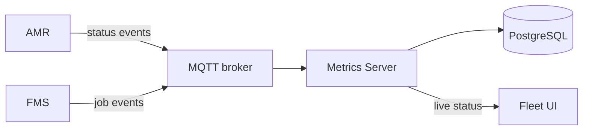

# Architecture

## User Stories

- As a fleet operator, I want to see each robot’s current status, so that I can monitor fleet
  operation.
- As a customer manager, I want to view job completion rate, cycle time, throughput, errors, and
  utilization, so that I can evaluate fleet performance.

## Components

- AMR (Autonomous Mobile Robots): Executes jobs and publishes status events.
- FMS (Fleet Management Server): Assigns jobs and publishes job events.
- MQTT broker: Delivers events to the Metrics Server.
- Metrics Server: Stores events, calculates metrics, and provides reporting data.
- PostgreSQL: Stores job, robot-state, and error history.
- Fleet UI: Displays live status and metrics.

## Diagram

