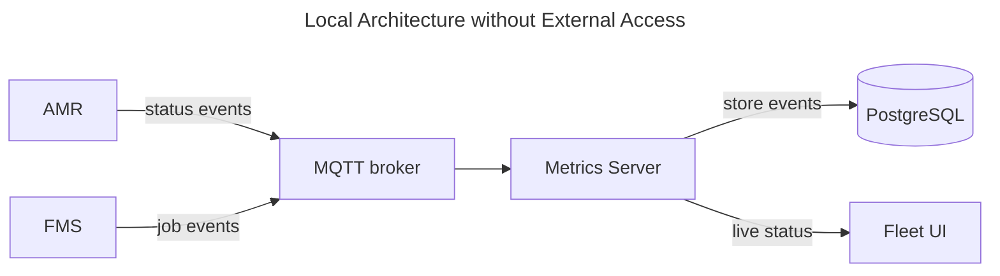
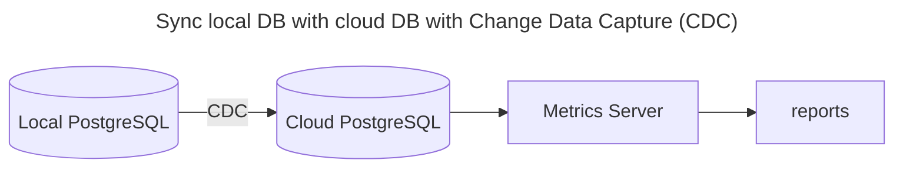
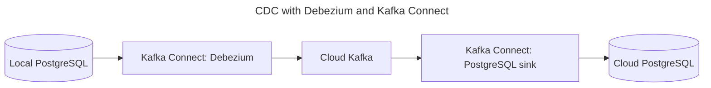

# Architecture

## User Stories

- As a fleet operator, I want to see each robot’s current status, so that I can monitor fleet
  operation.
- As a customer manager, I want to view job completion rate, cycle time, throughput, errors, and
  utilization, so that I can evaluate fleet performance.
- As an engineer, I want daily metrics aggregated across all customer sites, so that I can monitor
  fleet performance globally.

## Components

- AMR (Autonomous Mobile Robots): Executes jobs and publishes status events.
- FMS (Fleet Management Server): Assigns jobs and publishes job events.
- MQTT broker: Delivers events to the Metrics Server.
- Metrics Server: Stores events, calculates metrics, and provides reporting data.
- PostgreSQL: Stores job, robot-state, and error history.
- Fleet UI: Displays live status and metrics.

## Design Principles

> - Model every state change as an immutable event and write it to an append-only log.
> - Any read-optimized materialized views are derived from these events.
>
> — *Designing Data-Intensive Applications, 2nd Edition*, Chapter 12, “Stream Processing”

> change data capture (CDC), which is the process of observing all data changes written to a
> database and extracting them in a form in which they can be replicated to other systems
>
> — *Change Data Capture is having a moment. Why?*

## Diagrams

### Local Architecture



- AMR → MQTT broker: Publishes task execution, robot state, error, and heartbeat events.
- FMS → MQTT broker: Publishes task creation, assignment, and cancellation events.
- MQTT broker → Metrics Server: Delivers subscribed fleet events.
- Metrics Server → PostgreSQL: Validates and stores events.
- Metrics Server → Fleet UI: Provides live status and reports through the REST API.

### Cloud extension



- CDC sends committed database changes to the cloud through an outbound connection
- Operation can resume after network outages.

### Change Data Capture (CDC) Implementation



- Debezium reads committed PostgreSQL changes from the WAL.
- Kafka Connect sends them to cloud Kafka through an outbound connection.
- A cloud connector writes them to cloud PostgreSQL.
- Stored offsets allow synchronization to resume after a network outage.

## Events

### Event Write Strategies

- Publish task, robot-state, and error events immediately when they occur.
- Each AMR publishes a heartbeat with its current state every 30–60 seconds.
- AMRs and FMS store unsent events locally and retry them after disconnection or restart.
- The MQTT broker uses persistent storage and queues events while the Metrics Server is unavailable.
- The Metrics Server writes an event to PostgreSQL before acknowledging it.
- `event_id` prevents retried events from being stored more than once.
- Reporting failures do not interrupt task assignment or robot operation.

### Event Topics

- AMR publishes to `fleet/events/amr/{robot_id}`.
- FMS publishes to `fleet/events/fms`.
- Metrics Server subscribes to `fleet/events/#`.

The topics are general-purpose so other fleet components can consume the same events later.

### Event Message Format

```json
{
  "event_id": "event-101",
  "event_type": "robot_state_changed",
  "occurred_at": "2026-08-22T10:15:00Z",
  "robot_id": "amr-01",
  "task_id": "task-123",
  "data": {
    "state": "idle"
  }
}
```

### Event types

`event_type` describes what happened. Each event is published when the related change occurs.

| Event type            | Publisher | Description                                                        |
|-----------------------|-----------|--------------------------------------------------------------------|
| `task_created`        | FMS       | A new task was created.                                            |
| `task_assigned`       | FMS       | A task was assigned to an AMR.                                     |
| `task_cancelled`      | FMS       | A task was cancelled.                                              |
| `task_started`        | AMR       | The AMR started the task.                                          |
| `task_completed`      | AMR       | The AMR completed the task.                                        |
| `task_failed`         | AMR       | The AMR could not complete the task.                               |
| `robot_state_changed` | AMR       | The AMR changed state, such as moving, working, idle, or charging. |
| `error_raised`        | AMR       | The AMR reported an error.                                         |
| `robot_heartbeat`     | AMR       | The AMR periodically confirmed that it was online.                 |

Publish events with MQTT QoS 1. The Metrics Server uses `event_id` to ignore duplicate deliveries.

## Metrics Server and Database

### Database justification

PostgreSQL supports task relationships, time-based queries, duplicate-safe writes, and flexible
JSONB event data. A separate time-series database is unnecessary because events are not
high-frequency sensor data.

### Data model

The Metrics Server stores each received event as an immutable row in the `events` table.

```
CREATE TABLE events
(
  event_id    TEXT PRIMARY KEY,
  event_type  TEXT        NOT NULL,
  occurred_at TIMESTAMPTZ NOT NULL,
  received_at TIMESTAMPTZ NOT NULL DEFAULT NOW(),
  robot_id    TEXT,
  task_id     TEXT,
  data        JSONB       NOT NULL DEFAULT '{}'
);
```

- `received_at` is added by the Metrics Server when it receives the event.
- `robot_id` and `task_id` are optional because they do not apply to every event.
- `data` stores fields specific to the event type, such as the new robot state or error code.
- The primary key prevents the same `event_id` from being stored more than once.

### REST APIs

The Fleet UI reads live status and reports from the Metrics Server through these endpoints:

| Endpoint                              | Description                                                              |
|---------------------------------------|--------------------------------------------------------------------------|
| `GET /api/v1/robots/status`           | Return the latest state of each robot.                                   |
| `GET /api/v1/reports/completion-rate` | Return completed, failed, and cancelled task counts and completion rate. |
| `GET /api/v1/reports/productivity`    | Return average cycle time and completed tasks per hour.                  |
| `GET /api/v1/reports/errors`          | Return error counts grouped by error type and related task failures.     |
| `GET /api/v1/reports/utilization`     | Return time spent working, moving, idling, and charging.                 |

Report endpoints accept `from` and `to` timestamps and an optional `robot_id` query parameter.

## References

- Designing Data-Intensive Applications, 2nd Edition, Chapter 12, “Stream Processing”
- [Change Data Capture is having a moment. Why?](https://materialize.com/blog/change-data-capture-is-having-a-moment-why/)
