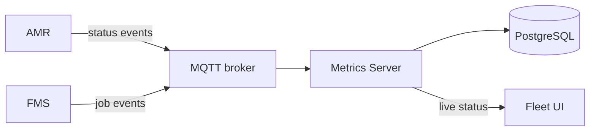

# Architecture

## User Stories

- As a fleet operator, I want to see each robot’s current status, so that I can monitor fleet
  operation.
- As a customer manager, I want to view job completion rate, cycle time, throughput, errors, and
  utilization, so that I can evaluate fleet performance.

## Components

- AMR (Autonomous Mobile Robots): Executes jobs and publishes status events.
- FMS (Fleet Management Server): Assigns jobs and publishes job events.
- MQTT broker: Delivers events to the Metrics Server.
- Metrics Server: Stores events, calculates metrics, and provides reporting data.
- PostgreSQL: Stores job, robot-state, and error history.
- Fleet UI: Displays live status and metrics.

## Diagram



## Events

### Topics

- AMR publishes to `fleet/events/amr/{robot_id}`.
- FMS publishes to `fleet/events/fms`.
- Metrics Server subscribes to `fleet/events/#`.

The topics are general-purpose so other fleet components can consume the same events later.

### Event Message Format

```json
{
  "event_id": "event-101",
  "event_type": "task_completed",
  "occurred_at": "2026-08-22T10:15:00Z",
  "robot_id": "amr-01",
  "task_id": "task-123",
  "data": {
    "state": "idle"
  }
}
```

### Event types

`event_type` describes what happened. Each event is published when the related change occurs.

| Event type            | Publisher | Description                                                        |
|-----------------------|-----------|--------------------------------------------------------------------|
| `task_created`        | FMS       | A new task was created.                                            |
| `task_assigned`       | FMS       | A task was assigned to an AMR.                                     |
| `task_cancelled`      | FMS       | A task was cancelled.                                              |
| `task_started`        | AMR       | The AMR started the task.                                          |
| `task_completed`      | AMR       | The AMR completed the task.                                        |
| `task_failed`         | AMR       | The AMR could not complete the task.                               |
| `robot_state_changed` | AMR       | The AMR changed state, such as moving, working, idle, or charging. |
| `error_raised`        | AMR       | The AMR reported an error.                                         |
| `robot_heartbeat`     | AMR       | The AMR periodically confirmed that it was online.                 |

Publish events with MQTT QoS 1. The Metrics Server uses `event_id` to ignore duplicate deliveries.
